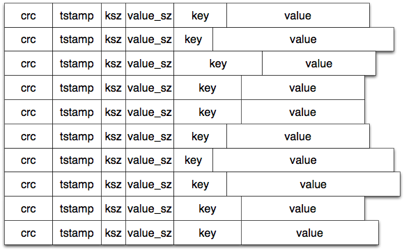

# Overview

Bitcask is a log structured key/value store.
Values are written by appending them to a file on disk and storing the position in an in-memory hash table: they **keydir**.
At any given point, there is a single writing process operating on a single active write file.
Any number of processes may read from a single bitcask directory concurrently.
The writing process will occassionally close its active file and open a new one, depending on certain configurable triggers (file size, number of keys).
Since writes only append data to files, a given key may correspond to multiple obsolete values on disk.
These obsolete values are reclaimed by merges.

Merges take a number of inactive files, write their contents to a set of new files after dropping obsolete ones.
Only one merge can be active at a time. Its writes are not coordinated with the main writer process, so races between those two processes are common.  These races are usually resolved using locks on in-memory data structures. Dealing with these races is the major source of complexity in the Bitcask code base.

# On disk format

* [bitcask_fileops:write/4][]

# Operations

* 

* [bitcask.erl](../src/bitcask.erl)

# Reads

# Writes

# The keydir

TBD: explain keydir data structures

# The writer process

# Key folds

# Data folds

# Iterators

# Data expiration

# Tombstone management

TBD

# Merges

TBD

# Locks

TBD

# Stats

TBD
